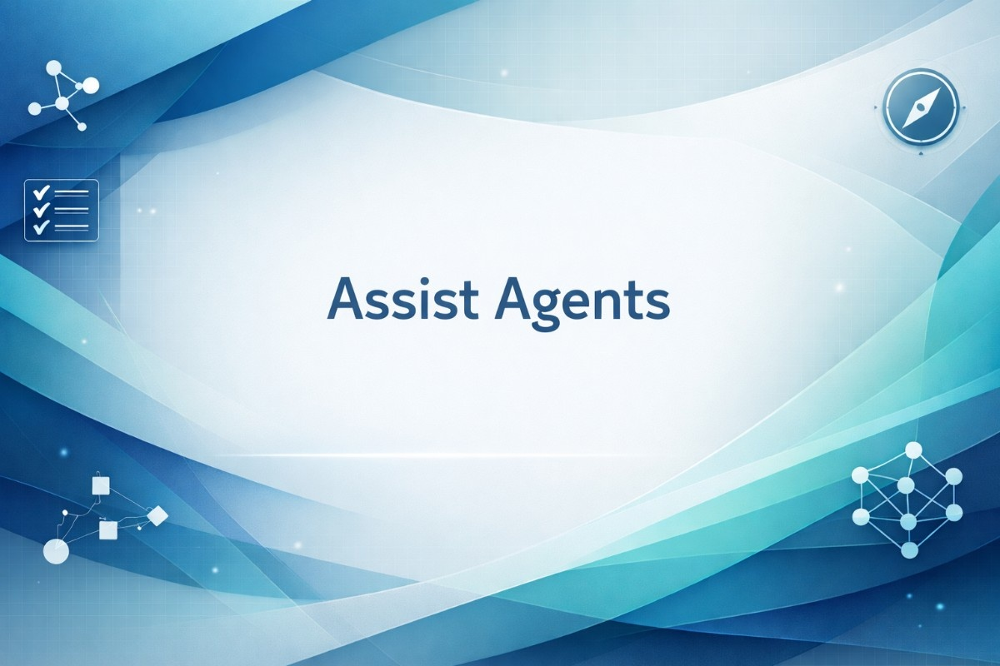

OpenCode AssistAgents is a ready-to-use agent pack for OpenCode users, built by a developer for developers who want tighter control over what agents do.
It installs practical agents, skills, and optional integrations so you can run a clear delivery loop: plan -> implement -> test -> review.

> [!WARNING]
> Early version: expect occasional rough edges. If you hit one, please open an issue/PR.

## Install / update

Requirements: Node.js >= 20.12.0.

```bash
npx @ozerohax/assistagents@latest
```

Run the same command again any time to update to the latest version.

Full documentation:

- [English](./doc/en/README.md)
- [Russian](./doc/ru/README.md)
- [Chinese](./doc/zh/README.md) - automatic translation, not verified

Main agent IDs:

- `build/dev` - code implementation, fixes, and step-by-step verification.
- `build/planner` - read-only implementation planning.
- `test` - testing plus test-report and bug-report artifacts.
- `review` - read-only code review and risk assessment.
- `doc` - user/operational documentation in the allowed docs scope.
- `project` - project management agent: planning, decomposition, and project artifact maintenance.
- `ask` - quick questions and research without edits.

Recommended loop: `build/planner -> build/dev -> test -> review`.

---

OpenCode is a trademark of its respective owner. This project is not affiliated with or endorsed by OpenCode.
