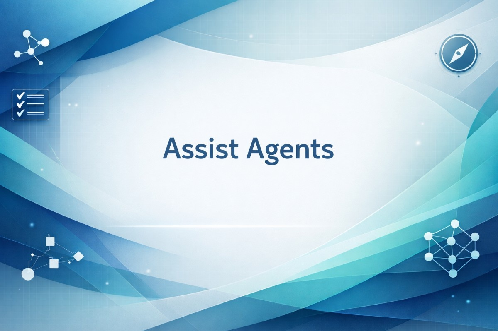

Ready-made agents and skills for OpenCode or Claude Code, built for developers who want control. You define the goal and constraints, the agent follows rules (skills/Context7/LSP), and you run the loop: generate → run → fix → verify.
Installs into `~/.opencode/` (OpenCode) or `~/.claude/` (Claude Code):
- `agents/` — roles
- `skills/` — playbooks
- `keys/` and `opencode.jsonc` — keys + global config

> [!WARNING]
> IMPORTANT: this is an early test version; if something is off, feel free to open an issue/PR.

## Install / update

```bash
npx -g @ozerohax/assistagents@latest
```

In the TUI you:
- select the product (OpenCode or Claude Code)
- choose languages for `skills/coder/*` (currently: TypeScript, Rust, C#) when installing OpenCode
- enter the preferred response language
- decide whether to make a zip backup and where to store it (OpenCode only)
- enter/update keys (OpenCode only)

### Quickstart
1) State the goal in one sentence: what to build + constraints + done criteria.
2) Run `planning/plan`: ask for a short plan, file list, risks, and what to test.
3) Run `build/dev`: implement the plan with minimal changes, no "fix everything nearby".
4) Run the project/build locally and capture the error/log.
5) Paste the error into `build/dev` (verbatim) and ask for a minimal fix + root cause.
6) Run `test/tester`: ask to cover done criteria with tests/manual checks.
7) Run `review/reviewer`: review correctness/security/tests and risk points.
8) Repeat `build/dev → test → review` in short loops until it is boring.

### Choosing an agent
- `build/dev` — change code
- `planning/plan` — reduce risk before edits
- `review/reviewer` — safety check
- `test/tester` — manual/API/browser verification
- `ask/ask` — quick answers or research

## What gets installed

Target structure (OpenCode):

- `~/.opencode/agents/` — agent definitions (YAML frontmatter + instructions)
- `~/.opencode/skills/` — skills (structured instructions/playbooks)
- `~/.opencode/keys/` — provider keys (files)
- `~/.opencode/opencode.jsonc` — OpenCode global config that references key files

Target structure (Claude Code):

- `~/.claude/settings.json` — user-level Claude Code settings
- `~/.claude/agents/` — subagent definitions (YAML frontmatter + prompt)
- `~/.claude/skills/` — skills (structured instructions/playbooks)

Claude Code uses user scope at `~/.claude/` only; project `.claude/` is intentionally not touched.

If your skills list is large, consider increasing tool description budget:

```bash
export SLASH_COMMAND_TOOL_CHAR_BUDGET=30000
```

## Agents (templates/agents)

Short list of roles the pack ships:

- `build/dev` — implementation/refactor/fixes, strict skills/Context7/LSP
- `planning/plan` and `planning/project` — read-only planning
- `review/reviewer` — correctness/security/tests review
- `test/tester` — manual/API/browser verification
- `ask/ask` + `assist/research/*` — Q&A and delegated research

Claude Code agent export details:

- Exported 1:1 from `templates/agents/**.md`
- Saved as `~/.claude/agents/<slug>.md` with YAML frontmatter and the original system prompt
- Tools are mapped to a minimal Claude Code tool set per agent type

## Skills (templates/skills)

Skills are playbooks agents load before work. Main groups: `planning/*`, `research-strategy/*`, `review/*`, `testing/*`, `coder/<language>/*` (selected in the TUI).

Claude Code skills export:

- All skills are copied to `~/.claude/skills/**` preserving structure
- Each skill directory must include `SKILL.md` (warnings are printed otherwise)
- Keep `SKILL.md` under 500 lines; move long reference material to supporting files

Note: if a skill is missing for a technology, the agent should say so and proceed cautiously.

## Local development

Requirements: Node.js >= 18.

```bash
npm install
npm run dev
```

---

OpenCode is a trademark of its respective owner. This project is not affiliated with or endorsed by OpenCode.
